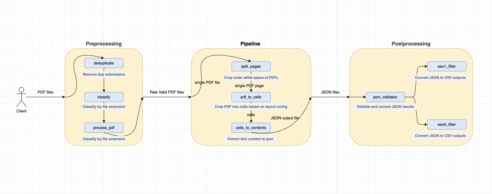

# **EEO Toolkit**

## **1. Introduction**

This is a library for processing scanned or digital EEO-1, EEO-4, and EEO-5 PDF reports as required by 141 of the Acts of 2024 (Massachusetts Salary Range Transparency Law).

The repository also includes tools for post-processing, data aggregation and analysis of the extracted data.

The repository provides custom parsing logic for different form types (e.g., EEO-1, EEO-4, EEO-5). This reduced parsing errors and improved extraction accuracy.

---

## **2. Library Overview**



The pipeline processes EEO-1, EEO-4, and EEO-5 forms (PDF or images) in batches and includes the following stages:

1. **Preprocessing** – Classifies, deduplicates, and re-renders input files for improved OCR performance.
2. **Optical Character Recognition** – Extracts text and table contents using a deep learning-based OCR engine, outputting structured JSON.
3. **Postprocessing & Filtering** – Segments content into structured fields and filters records by form type and geography (Massachusetts).
4. **Validation & Handling** – Validates extracted data (e.g., ZIP codes, city names) and joins with NAICS industry labels, organizational size bins, and county-level identifiers to produce an enriched CSV.
5. **Melting** – Reshapes the wide-format CSV into a long format (one row per Race × Gender × dimension combination), materializing the full Cartesian product so all combinations are represented.
6. **Differential Privacy** – Applies OpenDP Laplace noise to the melted data, producing a differentially private main table and curated side tables.
7. **Sheet Generation** – Adjusts the noisy tables to enforce non-negativity of marginals via Mixed Integer Programming, applies structural zeroes where applicable, and writes publication-ready Excel workbooks.
8. **Figure Generation** – Consumes the adjusted tables to produce publication-ready charts and summary figures.


### **Pipeline Components**

| Component            | Tool Used        | Description                                                                        |
|----------------------|------------------|------------------------------------------------------------------------------------|
| Image Preprocessing  | OpenCV, PIL      | Deduplication, formatting, scaling, padding                                        |
| OCR Engine           | DocTR            | Handwritten and printed text recognition                                           |
| Postprocessing       | Python           | Field extraction, form segmentation, validation and correction                     |
| Data Aggregation     | Pandas           | JSON parsing, NAICS/county joins, group-by, melt to long format                   |
| Differential Privacy | OpenDP           | Laplace noise on contingency tables with configurable epsilon budget               |
| Sheet Generation     | cvxpy, openpyxl  | MIP-based non-negativity adjustment, structural zeroes, Excel workbook generation  |
| Figure Generation    | Matplotlib       | Bar charts and summary figures from adjusted DP output                             |


Each component is built as an independent, reusable module, facilitating extensibility and debugging.


### **Per-Form-Type Scripts**

The OCR postprocessing and data aggregation stages each have form-specific implementations. The table below shows coverage by form type.

| Stage                | EEO-1                          | EEO-4                                          | EEO-5                                            |
|----------------------|--------------------------------|------------------------------------------------|---------------------------------------------------|
| Filter               | `eeo1_filter.py`               | `eeo4_type1_filter.py`, `eeo4_type2_filter.py` | `eeo5_filter.py`                                   |
| Handler              | `eeo1_handler.py`              | `eeo4_handler.py`                              | `eeo5_handler.py`, `eeo5_handler_dedup.py`         |
| Melt                 | `eeo1_melt.py`                 | `eeo4_melt.py`                                 | `eeo5_melt.py`, `eeo5_melt_dedup.py`               |
| Differential Privacy | `eeo1_dp.py`                   | `eeo4_dp.py`                                   | `eeo5_dp.py`                                       |
| Sheet Generation     | `eeo1_sheet_generation.py`     | `eeo4_sheet_generation.py`                     | `eeo5_sheet_generation.py`                         |
| Figure Generation    | `eeo1_figure_generation.py`    | `eeo4_figure_generation.py`                    | `eeo5_figure_generation.py`                        |

Filter scripts live under `ocr/postprocess/`. Handler, melt, DP, and sheet generation scripts live under `data_aggregation/`. Figure generation scripts live under `figure_generation/`.

---

## **3. How to Use**

### **3.1 Requirements**

- Ubuntu 22.04.5 LTS
- Python ≥ 3.10.12
- Dependencies listed in `requirements.txt`  
- Offline OCR models downloaded and stored locally  

### **3.2 Steps**
1. **Clone the repository**

    ```bash
   git clone
   ```

2. **Create and activate a virtual environment**:
   ```bash
   python3 -m venv venv
   source venv/bin/activate
   ```
3. **Install dependencies**:
   ```bash
   pip install -r requirements.txt
   ```
4. **(Optional) Deactivate** when done:
   ```bash
   deactivate
   ```

---

## **4. OCR Tools Explored**


The entire pipeline is designed to run in an air-gapped environment. All models and tools used are available offline after the initial setup.


For the purpose of this project, we explored 3 different OCR tools: Tesseract, Nougat and DocTR.

| OCR Engine                                              | Accuracy                                   | Support Complex Layout | Support Handwritten Forms | Comments                                                         |
|---------------------------------------------------------|--------------------------------------------|------------------------|---------------------------|------------------------------------------------------------------|
| [Tesseract](https://github.com/tesseract-ocr/tesseract) | Medium accuracy                            | No                     | No                        | Cannot distinguish form borders and handle complex layouts       |
| [Donut](https://github.com/clovaai/donut)               | High accuracy on plaintext documents       | Yes                    | Yes                       | Requires GPU for reasonable inference time; needs to be fine-tuned for different tasks |
| [DocTR](https://github.com/mindee/doctr)                | High accuracy across varied document types | Yes                    | No                        | No good support for handle handwritten forms                     |

Since the EEO-1 and EEO-4 forms are structured and have a complex layout, and we only have CPU resources, we chose to use **DocTR** for the OCR engine.

---


## **5. Limitations and Challenges**

- **Handwritten data variability** – Especially problematic with cursive or non-standard characters

---

## Authors
**Anthony Huang**: https://github.com/anthua20

**Jida Li**: https://github.com/jidalii

**Rohit Vemparala**: https://github.com/RVKarmani

**Haodong Xu**: https://github.com/chuckhxu
