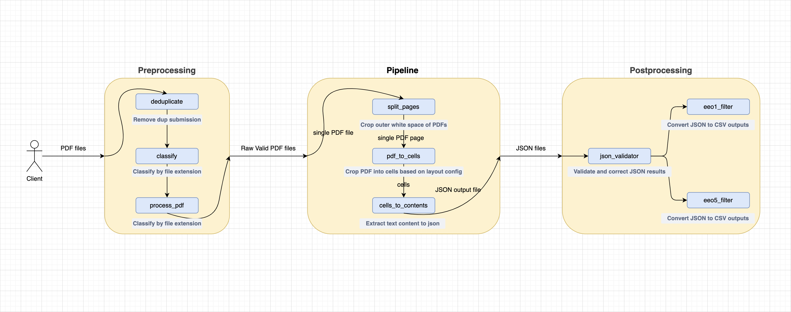

# OCR Pipeline for EEO PDF Files

A compliance automation tool for processing **EEO-1** and **EEO-5** PDF reports as required by *Section 141 of the Massachusetts Salary Range Transparency Law (2024)*. Converts typed and scanned PDF documents into structured JSON data with automated OCR processing and workforce statistics aggregation.

---

## Table of Contents

- [OCR Pipeline for EEO PDF Files](#ocr-pipeline-for-eeo-pdf-files)
  - [Table of Contents](#table-of-contents)
  - [Features](#features)
  - [Technical Stack](#technical-stack)
  - [Pipeline Architecture](#pipeline-architecture)
  - [Installation](#installation)
  - [Usage](#usage)
    - [1. Configure Layout \& Checkbox YAML](#1-configure-layout--checkbox-yaml)
    - [2. Pre-Processing (Optional)](#2-pre-processing-optional)
      - [2.1 Classification](#21-classification)
      - [2.2 Deduplication](#22-deduplication)
      - [2.3 Layer Rendering Fix](#23-layer-rendering-fix)
    - [3. Run OCR Pipeline](#3-run-ocr-pipeline)
  - [Folder Structure](#folder-structure)
  - [Configuration File Schemas](#configuration-file-schemas)
  - [Logging](#logging)
  - [Troubleshooting](#troubleshooting)

---

## Features

- **PDF-to-JSON Conversion**: End-to-end OCR pipeline for digitizing EEO reports.
- **Data Aggregation**: Workforce statistics extraction and summary via Pandas.
- **Form Layout Configuration**: YAML-based cell and checkbox layouts for EEO-1, and EEO-5.
- **Modular Pipeline**: The whole pipeline is divided into the preprocessing, ocr pipeline, and postprocessing parts, each is easily pluggable .

---

## Technical Stack

- **Language**: Python 3.8+
- **OCR Engine**: [DocTR](https://github.com/mindee/doctr)
- **Data Aggregation**: Pandas
- **Visualization**: Matplotlib
- **GUI Tools**: Tkinter for coordinate extraction and JSON viewer scripts

---

## Pipeline Architecture



---

## Installation

1. **Clone the repository**
2. **Create and activate a virtual environment**:
   ```bash
   python3 -m venv venv
   source venv/bin/activate
   ```
3. **Install dependencies**:
   ```bash
   pip install -r requirements.txt
   ```
4. **(Optional) Deactivate** when done:
   ```bash
   deactivate
   ```

---

## Usage

### 1. Configure Layout & Checkbox YAML

- The pipeline relies on coordinate maps for each cell and checkbox region. Ensure the following files are present under `OCR/config`:
  - **EEO-1 Type1**:
    - `eeo1_typed_type1.yaml` (cells)
    - `eeo1_typed_type1_checkbox.yaml`
  - **EEO-1 Type2**:
    - `eeo1_typed_type2.yaml`
    - `eeo1_typed_type2_checkbox.yaml`
  - **EEO-5**:
    - `eeo5_typed.yaml`
    - `eeo5_typed_checkbox.yaml`

> **Tip**: To calibrate new layouts, use the GUI utility:
>
> ```bash
> python3 ocr/visualization/get_location.py
> ```
>
> and click cell corners to export YAML tuples.

### 2. Pre-Processing (Optional)

#### 2.1 Classification

Use `ocr/preprocess/classify.py` to separate EEO-1 vs. EEO-5 PDFs.

```bash
python3 ocr/preprocess/classify.py
```

#### 2.2 Deduplication

Identify and remove duplicate forms based on file hashes:

```bash
python3 ocr/preprocess/deduplicate.py
```

#### 2.3 Layer Rendering Fix

Apply rendering corrections for PDF layers that misalign text and forms:

```bash
python3 ocr/preprocess/re_render_pdf.py
```

### 3. Run OCR Pipeline

Edit `run_pipeline.py` to set:

- `input_dir`
- `FORM_TYPE` (`eeo1` or `eeo5`)
- Paths to YAML configs

Then:

```bash
python3 ocr/run_pipeline.py
```

This generates `<formname>_result.json` files under `../files/results`.

---

## Folder Structure

```
├── ocr/
│   ├── config/           # YAML for cell & checkbox layouts
│   ├── pipeline/         # ocr split, cell extraction, JSON conversion
│   ├── preprocess/       # classify, dedupe, rendering scripts
│   └── visualization/    # GUI tools (coord extraction, JSON viewer)
├── utils/                # Config loading helpers
├── run_pipeline.py       # Main entrypoint
├── organize_results.py   # Post-run file organization
├── requirements.txt
└── README.md             # This documentation
```

---

## Configuration File Schemas

**Cell layout YAML**:

```yaml
table:
  CELL_NAME: !!python/tuple
    - upper_right_x
    - upper_right_y
    - bottom_left_x
    - bottom_left_y
```

**Checkbox layout YAML**:

```yaml
checkbox_field: !!python/tuple
  - upper_right_x
  - upper_right_y
  - bottom_left_x
  - bottom_left_y
```

---

## Logging

All pipeline logs are stored under `logs/` with filenames `<formname>.log`. Uses a prefixed timestamp format.

---

## Troubleshooting

- **No OCR output?** Verify `det_arch` and `reco_arch` in `run_pipeline.py` match installed DocTR models.
- **Invalid table sums?** Adjust `table_config.yaml` cell coordinates or increase `CONFIDENCE_THRESHOLD`.
- **Missing files?** Ensure intermediate `tmp/` directory is cleared after each run by `run_pipeline.py`.

Feel free to raise issues or submit pull requests for missing aggregation features!
