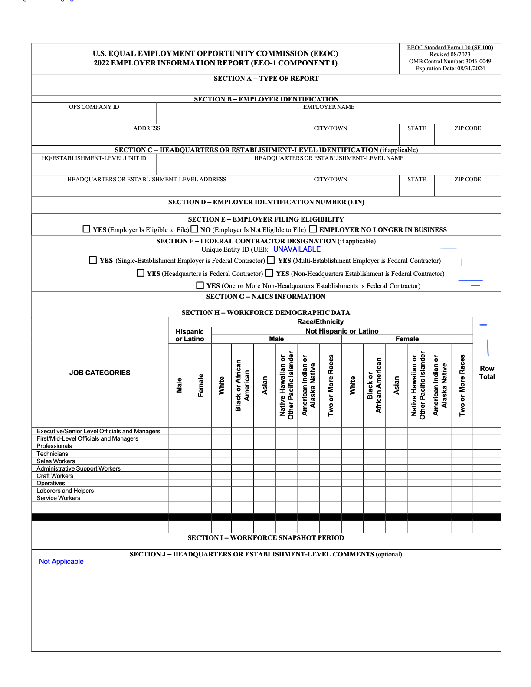
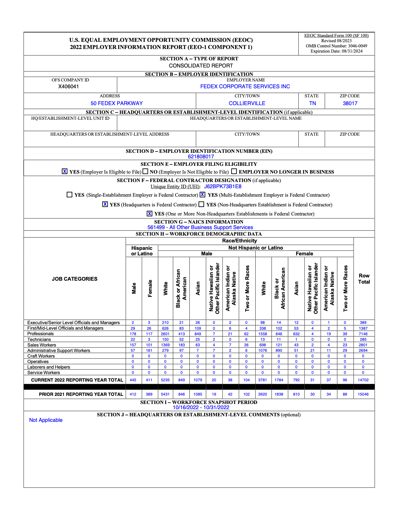

# EEO Form Preprocessing

This directory contains scripts to validate, deduplicate and re-render scanned or typed EEO forms.

---

## Overview

This preprocessing pipeline provides the following functionality:

- Deduplicate files using SHA-256 content hashes to avoid redundant processing
- Classify files based on extension to filter out unsupported types (e.g., `.csv`, `.xlsx`)
- Re-render PDFs using Firefox headless printing to fix layout issues such as misaligned checkboxes or form fields


---

## How to Use

### Requirements

- Python 3.10.12
- Firefox (installed via Snap or system)
- [Geckodriver](https://github.com/mozilla/geckodriver) (make sure path is set in `re_render_pdf.py`)
- Selenium (`pip install selenium`)


Be sure to update file paths and Firefox settings in the scripts as needed.

### Step 1: Deduplicate Files
Remove exact duplicate files based on content hash.

```bash
python deduplicate.py
```
Output files:
- Only one retained copy per duplicate group

### Step 2: Classify Files by Type
Organize files into folders by extension and separate out unsupported types.

```bash
python classify.py
```

Output files:
- Organized folders by file type (e.g., `pdf/`, `xlsx/`, `No_Extension/`)

### Step 3: Re-render PDFs with Layout Fixes (Optional)
> [!NOTE]
> `re_render_pdf.py` assumes Firefox profile access and a configured environment for headless PDF printing.  
> The Firefox browser is restarted periodically in `re_render_pdf.py` to prevent crashes during batch processing.

```bash
python re_render_pdf.py
```

Output files:
- Re-rendered and corrected PDF documents

Fix formatting issues in PDF forms by printing them via a headless Firefox session.
See example below:


Before:  


After:  


---
